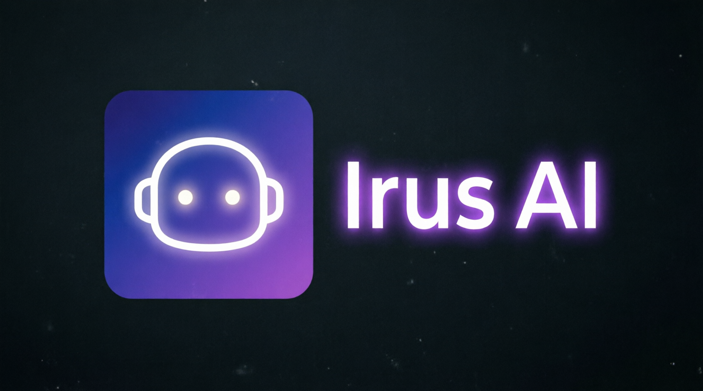

<p align="center">
  
</p>

<h1 align="center">🤖 Irus AI — Your Personal AI Command Center</h1>

<p align="center">
  <b>Chat · Live Web Search · Document Intelligence · Vision · Image Generation · Memory · Voice · Multi-Model Compare · Public API</b><br/>
  A full-stack, production-grade, installable AI assistant platform — <b>free for everyone, forever.</b>
</p>

<p align="center">
  <a href="https://irus-ai.onrender.com"></a>
  <a href="https://github.com/NejamulHaque/Irus-AI/actions"></a>
  <a href="https://github.com/NejamulHaque/Irus-AI/blob/main/LICENSE"></a>
</p>

<p align="center">
  
  
  
  
  
  
  
</p>

---

## 🎯 One-Line Pitch

> A **self-hosted ChatGPT-style platform** with web search, document RAG, vision, image generation, long-term memory, a developer API, and an enterprise-grade admin control plane — deployed free on Render with a full DevSecOps pipeline.

---

## ✨ Feature Showcase

### 🧠 Intelligence Layer
- **Streaming AI Chat** — Groq (Llama 3.1 / 3.3 / Qwen 3.6 Vision) with automatic cloud-safe fallback chain (Groq → Gemini → OpenRouter → Pollinations → Ollama)
- **Live Web Search** — Perplexity-style answers with clickable cited sources (DuckDuckGo)
- **Document Intelligence** — Chat with PDFs / DOCX / TXT using semantic embeddings with keyword-search fallback
- **Vision Mode** — Upload images, ask questions, get detailed analysis via Llama-4 Vision / Qwen-3.6
- **AI Image Generation** — Free, unlimited image creation via Pollinations.ai (`/image` command)
- **Long-Term Memory** — Irus remembers facts across every conversation (`Remember that I prefer concise answers`)
- **Multi-Model Compare** — Side-by-side live streaming of Groq vs Pollinations answers on the same prompt
- **Creator Identity** — Ask *"who made you?"* → deterministic answer: **Nejamul Haque**
- **Voice Mode** — Browser-native speech-to-text + read-aloud for any message

### 💬 Chat Experience
- Multiple conversations with **folders**, rename, delete, full-text search
- Edit, regenerate, copy, speak any message
- Follow-up suggestion chips after every reply
- Markdown rendering with **syntax-highlighted code blocks** + one-click copy
- **Slash commands** (`/`) and a **Ctrl+K command palette**
- Drag & drop document upload · smart auto-scroll · response-time badges
- Live connection status indicator · typewriter placeholder · onboarding toasts
- Export any chat as **Markdown**
- Public share links with one-click revocation

### 🏗️ Platform & Developer Features
- Modern 2026 glassmorphic UI with **Dark / Light theme** (persisted)
- **Installable PWA** — add to home screen on phone/desktop, offline shell
- **Personal API Keys** with prefix + SHA-256 hash (never stored in plaintext)
- **Developer Console** with live request logs, latency tracking, code samples (cURL / Python / JS)
- **Public REST API** (`/api/v1/chat`, `/api/v1/me`) with rate limiting
- Secure auth: email + username login, password policy, honeypot, rate limiting
- User profiles: avatar (DB-stored base64), bio, preferred model, password change
- **UPI QR payment** support modal for donations

### 🛡️ Enterprise Admin Control Plane (10 Features)
1. **System Health Dashboard** — 6 KPI cards, online status
2. **7-Day Activity Charts** — messages + signups bar graphs
3. **User Management** — promote/demote admins, ban users, delete accounts
4. **Login Audit Log** — track every login with IP + user-agent
5. **Abuse Monitor** — top 5 IPs by login hits
6. **Model Usage Breakdown** — which AI models users prefer
7. **Site-wide Broadcast Banner** — push announcements to all users
8. **System Error Logs** — view + one-click clear
9. **Content Moderation** — inspect any user's chat
10. **CSV User Export** — download database for reports

### 🔐 Security & DevSecOps
- Passwords hashed (Werkzeug scrypt) · generic login errors (no user enumeration)
- Rate limiting per user/IP · honeypot anti-bot field · input validation
- `HttpOnly` + `SameSite` session cookies · security headers on every response
- CSRF-safe JSON endpoints · admin role gating
- **GitHub Actions CI/CD**: Gitleaks → Bandit → pip-audit → Trivy → Pytest → auto-deploy

---

## 🛠️ Tech Stack

| Layer | Technology |
|-------|------------|
| **Backend** | Flask 3.1, SQLAlchemy, Flask-Login, Flask-Migrate, Flask-Limiter, Gunicorn |
| **Database** | PostgreSQL 16 (Neon) / SQLite (dev) |
| **AI Providers** | Groq, Pollinations, OpenRouter, Gemini, Ollama (local), DuckDuckGo |
| **Frontend** | Jinja2, Tailwind CSS, Vanilla JS, marked.js, DOMPurify, highlight.js, qrcodejs |
| **PWA** | Service Worker, Web App Manifest, iOS splash screens |
| **DevOps** | Docker, docker-compose, Render, Neon, GitHub Actions |
| **Security** | Gitleaks, Bandit, pip-audit, Trivy, Pytest |

---

## 🚀 Quick Start (Local)

### Prerequisites
- Python 3.10+
- [Groq API key](https://console.groq.com) (free)
- *(Optional)* [Ollama](https://ollama.com) for local models

### 1. Clone & install
```bash
git clone https://github.com/NejamulHaque/Irus-AI.git
cd Irus-AI
python -m venv venv
source venv/bin/activate          # Windows: venv\Scripts\activate
pip install -r requirements.txt
```

### 2. Configure `.env`
```env
SECRET_KEY=change-me-to-a-long-random-string
GROQ_API_KEY=gsk_your_key_here
GROQ_VISION_MODEL=qwen/qwen3.6-27b
AI_PROVIDER=groq
OLLAMA_MODEL=llama3.2
OLLAMA_BASE_URL=http://localhost:11434
DATABASE_URL=
SESSION_COOKIE_SECURE=false
EMBEDDING_PROVIDER=off

# Optional extra fallback keys (free tiers):
GEMINI_API_KEY=
OPENROUTER_API_KEY=
```

### 3. Migrate & run
```bash
flask --app run db upgrade
python run.py
```

Open **http://localhost:5000** — the **first registered account automatically becomes the Admin** 🛡️

---

## 🐳 Docker (one-command setup)

```bash
docker compose up --build
```
Runs the app with **PostgreSQL 16**, automatic migrations, and Gunicorn.

---

## ☁️ Deploy for Free (Render + Neon)

1. Push this repo to GitHub.
2. Create a free Postgres DB at [neon.tech](https://neon.tech) → copy `DATABASE_URL`.
3. On [render.com](https://render.com) create a **Web Service**:
   - **Build:** `pip install -r requirements.txt && flask --app run db upgrade`
   - **Start:** `./start.sh`
   - **Instance:** Free
   - **Env vars:** `SECRET_KEY`, `GROQ_API_KEY`, `GROQ_VISION_MODEL`, `DATABASE_URL`, `AI_PROVIDER=groq`, `SESSION_COOKIE_SECURE=true`
4. Deploy → live at `https://your-app.onrender.com` with HTTPS + installable PWA. 🎉

---

## 🔑 Developer API

Generate a personal API key from `/api-keys` (or `Ctrl+K → "API Keys"`).

### Endpoints

| Method | Endpoint | Description |
|--------|----------|-------------|
| `GET` | `/api/v1/me` | Validate key & get account info |
| `POST` | `/api/v1/chat` | Send a message, get a reply |

### Example — cURL
```bash
curl -X POST https://irus-ai.onrender.com/api/v1/chat \
  -H "Authorization: Bearer irus_YOUR_KEY" \
  -H "Content-Type: application/json" \
  -d '{"message": "Hello from my terminal!", "web_search": false}'
```

### Example — Python
```python
import requests

r = requests.post(
    "https://irus-ai.onrender.com/api/v1/chat",
    headers={"Authorization": "Bearer irus_YOUR_KEY"},
    json={"message": "Explain Python decorators", "web_search": True},
)
print(r.json()["reply"])
```

### Example — JavaScript
```javascript
const r = await fetch("https://irus-ai.onrender.com/api/v1/chat", {
  method: "POST",
  headers: {
    "Authorization": "Bearer irus_YOUR_KEY",
    "Content-Type": "application/json"
  },
  body: JSON.stringify({ message: "Hello!" })
});
console.log((await r.json()).reply);
```

Rate limit: **30 requests / minute** per API key.

---

## ⌨️ Keyboard Shortcuts

| Keys | Action |
|------|--------|
| `Ctrl/⌘ + K` | Open command palette |
| `?` | Show shortcuts overlay |
| `/` | Slash commands (`/web`, `/image`, `/compare`, `/doc`, `/remember`…) |
| `Enter` | Send message |
| `Shift + Enter` | New line |
| `Esc` | Stop generation / close menus |

---

## 📁 Project Structure

```
Irus-AI/
├── app/
│   ├── __init__.py            # App factory, limiter, migrations, security headers
│   ├── models.py              # User, Conversation, Message, Document, Chunk, Memory,
│   │                          # ErrorLog, APIKey, APIRequestLog, LoginAudit, Broadcast
│   ├── routes.py              # All endpoints (auth, chat, admin, API, compare)
│   ├── services/
│   │   ├── ai_service.py      # Multi-provider streaming + fallback chain
│   │   ├── document_service.py# In-memory extraction + semantic/keyword retrieval
│   │   └── search_service.py  # DuckDuckGo live web search
│   ├── static/                # theme.css, PWA icons, manifest.json, sw.js
│   └── templates/             # base, auth, chat, profile, admin, api_keys, share
├── migrations/                # Alembic migrations
├── tests/                     # pytest security tests
├── .github/workflows/         # DevSecOps CI/CD pipeline
├── config.py
├── run.py
├── start.sh                   # Production entrypoint (migrate + gunicorn)
├── Dockerfile
├── docker-compose.yml
└── requirements.txt
```

---

## 🔐 Security Posture

- **Authentication:** Werkzeug scrypt password hashing · generic login errors
- **Session:** `HttpOnly` + `SameSite=Lax` + `Secure` cookies
- **Rate limiting:** 20/min login · 40/min chat · 30/min API · 10/min upload
- **Anti-bot:** honeypot field, captcha-ready
- **Headers:** CSP, HSTS, X-Frame-Options, X-Content-Type-Options on every response
- **Admin gating:** role-based access on every privileged route
- **Ban enforcement:** banned users cannot log in, even with correct credentials
- **Key hygiene:** API keys stored as SHA-256 hash, prefix-only display, show-once on creation

---

## ☕ Support the Developer

Irus AI is free for everyone, forever. If it helps you, consider fueling its development:

- **UPI:** `nejamulhaque@upi` (in-app QR code supported)
- **Buy Me a Coffee:** [buymeacoffee.com/nejamulhaque](https://www.buymeacoffee.com/nejamulhaque)

---

## 👨‍💻 Author

**Nejamul Haque** · [github.com/NejamulHaque](https://github.com/NejamulHaque)

Built end-to-end with ❤️ using Flask, open AI models, and a lot of coffee.

---

## 📄 License

**MIT** — free to use, modify and share.

---

<p align="center">
  <sub>If this project helped you, a ⭐ on GitHub goes a long way!</sub>
</p>
